# Continuous Monitoring and Feedback Loops

Once software is deployed, continuous monitoring ensures it remains healthy, performs well, and meets user needs. This page covers observability, real-time feedback mechanisms, and ongoing maintenance strategies.

!!! note "Scope and Precedence"
This page provides engineering implementation guidance for observability (logs, metrics, traces, feedback loops). Normative monitoring objectives, required signal sets, and federation-level monitoring expectations are defined in D6.2 §7.2 and the relevant monitoring requirements in Chapter 8. Where overlaps exist, Chapter 7/8 are authoritative.

---

## Implementing Telemetry and Observability

Observability means understanding what is happening inside your systems based on external outputs. The three pillars of observability work together to provide complete system insight.

### The Three Pillars of Observability

| Pillar | Purpose | What It Provides |
|--------|---------|------------------|
| **Logs** | Detailed records of discrete events | Context for debugging specific issues |
| **Metrics** | Numerical measurements over time | Trends, patterns, and anomaly detection |
| **Traces** | Request flows through distributed systems | End-to-end visibility of request paths |

#### Why All Three Matter

- **Logs** explain what happened (and often why)
- **Metrics** quantify how much/how often and support alerting
- **Traces** show where time is spent and how requests propagate

Together, they enable faster incident diagnosis and performance optimization.

### Structured Logging

Structured logging uses a consistent, machine-parsable format (commonly JSON) rather than free-form text. This improves automated processing and cross-service correlation.

| Benefit | Practical Outcome |
|---------|-------------------|
| **Searchability** | Query by fields (e.g., `request_id`, `user_id`, `error_code`) |
| **Aggregation** | Produce statistics across events (error rates, top endpoints) |
| **Correlation** | Link related events across services via correlation IDs |
| **Automation** | Trigger alerts on patterns and support routing/triage |

#### Recommended Key Practices

- **Include standard fields**: Timestamp, severity, service, environment, `request_id` (or equivalent)
- **Add domain fields** where relevant (e.g., `object_id`, `collection`, `user_id`), avoiding sensitive data
- **Use consistent field names** across services to support unified queries and dashboards
- **Propagate correlation IDs** across service boundaries to enable end-to-end tracing

### Metrics Collection

Metrics track numerical values over time, enabling trend analysis and alerting.

#### Essential Metric Types

| Metric Type | Example | Use Case |
|-------------|---------|----------|
| **Counters** | Total API requests | Track cumulative events |
| **Gauges** | Active user sessions | Monitor current state |
| **Histograms** | Request duration distribution | Understand performance percentiles |
| **Summaries** | Request size quantiles | Statistical analysis |

#### Common Monitoring Patterns

- **RED method**: Rate, Errors, Duration (for services)
- **USE method**: Utilization, Saturation, Errors (for resources)
- **Four Golden Signals**: Latency, traffic, errors, saturation

!!! tip "Standard Formats"
Prometheus format is widely adopted and supported by visualization tools like Grafana. Standard formats enable tool interoperability and reduce lock-in.

### Distributed Tracing

In microservices architectures, a single user request may touch multiple services. Distributed tracing tracks the entire request flow.

#### What Traces Reveal

- Which services were involved in a request
- How long each service took to respond
- Where bottlenecks occur
- Which service failed in an error scenario

#### Key Concepts

- **Span**: A single operation within a trace (e.g., database query, API call)
- **Trace**: Collection of spans representing a complete request flow
- **Context propagation**: Passing trace IDs across service boundaries

#### Implementation Considerations

- **Add minimal overhead** — Tracing should not significantly slow down services
- **Sample strategically** — Trace all errors; sample normal requests
- **Standardize on trace format** — OpenTelemetry is a common cross-stack standard

### Monitoring Stack Architecture

A complete monitoring setup integrates logs, metrics, and traces.



#### Component Roles

- **Log aggregation** (Loki / Elasticsearch): Centralize and search logs
- **Metrics storage** (Prometheus): Time-series storage for metrics
- **Trace storage** (Jaeger / Tempo): Store and query distributed traces
- **Visualization** (Grafana): Unified dashboards for telemetry
- **Alerting** (Alertmanager): Route alerts based on conditions and rules

!!! tip "Integrated Monitoring"
Problems are easier to diagnose when you can correlate metrics spikes with specific log entries and trace the affected requests end-to-end.

---

## Real-Time Feedback Mechanisms

Real-time feedback during deployments helps catch issues before they affect all users.

### Canary Releases

Deploy new versions to a small subset of users first, monitoring closely before full rollout.
```
[Load Balancer]
├─ 95% traffic → [Version 2.0] (stable)
└─ 5% traffic → [Version 2.1] (canary)
```

#### Canary Deployment Monitoring

| Metric | Acceptable Range | Action if Exceeded |
|--------|------------------|-------------------|
| Error rate | < 1% increase | Immediate rollback |
| Response time | < 10% increase | Investigate; possible rollback |
| Resource usage | < 20% increase | Monitor; adjust capacity |
| User behavior anomalies | No significant change | Investigate unexpected patterns |

#### Rollout Strategy (Example)

1. Deploy to 5% of traffic
2. Monitor for 15–30 minutes
3. If stable, increase to 25%
4. Continue monitoring, increase to 50%
5. Complete rollout to 100%

!!! tip "Why Canary Releases Work"
Issues affect only a small fraction of users initially, minimizing impact while providing real-world validation.

### Automated Rollback Triggers

Define conditions that trigger automatic rollback without human intervention.

#### Common Trigger Conditions

- Error rate exceeds threshold (e.g., 5% of requests)
- Response time increases beyond acceptable limit (e.g., p95 > 2 seconds)
- Critical health check failures
- Resource exhaustion (CPU > 90%, memory > 95%)

#### Benefits

- **Immediate response** to problems (no waiting for human detection)
- **Reduced MTTR** (mean time to recovery)
- **Protection** from prolonged degraded user experience
- **24/7 operation** outside business hours

#### Implementation Considerations

- Set thresholds carefully to avoid false positives
- Ensure rollback is well-tested
- Log all automated rollbacks for post-mortem analysis
- Alert humans even when automatic rollback succeeds

### Feature Flags

Feature flags enable/disable functionality without redeployment, decoupling deployment from feature activation.

#### Use Cases

| Scenario | Benefit |
|----------|---------|
| Testing in production | Limited exposure to real users |
| Quick rollback | Toggle flag instead of redeploying |
| A/B testing | Different features for different user segments |
| Gradual rollouts | Increase feature exposure progressively |
| Kill switches | Disable problematic features instantly |

#### Implementation Patterns

- **Simple boolean flags** for on/off features
- **Percentage-based rollouts** (e.g., show to 20% of users)
- **User segment targeting** (e.g., beta testers)
- **Time-based flags** (activate at specific times)

!!! tip "Deployment vs. Activation"
Traditional deployments couple code shipping with feature activation. Feature flags allow shipping code safely, then enabling features gradually (or disabling instantly if issues appear).

---

## Handling Service Updates and Ongoing Maintenance

Services require continuous care beyond initial deployment, including updates, migrations, deprecation, and end-of-life management.

### Update Strategies

#### Zero-Downtime Updates (for Critical Services)

| Technique | How It Works | Best For |
|-----------|--------------|----------|
| **Rolling updates** | Replace instances gradually, one at a time | Stateless services |
| **Blue-green deployment** | Two identical environments; switch traffic instantly | Mission-critical services needing instant rollback |
| **Database migrations** | Backward-compatible changes in multiple steps | Schema changes that must remain compatible |

#### Maintenance Windows (for Complex Updates)

Best practices for scheduled maintenance:

- **Schedule during lowest-usage periods** (analyze traffic patterns first)
- **Announce well in advance** (minimum 1 week for minor; 1 month for major)
- **Provide status updates** during maintenance
- **Have a tested rollback plan** ready
- **Communicate completion** and any residual issues

### API Deprecation Process

When deprecating APIs or features, follow a phased approach respecting user needs.

| Phase | Timeline | Actions |
|-------|----------|---------|
| **Phase 1: Announce deprecation** | 3–6 months before removal | Deprecation notice in docs; optionally headers in responses; direct notifications to known users; explain alternatives |
| **Phase 2: Provide migration guidance** | During deprecation | Examples, migration tooling if possible, dedicated support |
| **Phase 3: Sunset period** | Final 1–2 months | Deprecation warnings; track usage; assist remaining users |
| **Phase 4: Final removal** | After deadline | Remove only after announced deadline; return clear errors pointing to alternatives; retain explanatory documentation |

### Dependency Updates

Regular dependency updates are essential for security, stability, and performance.

#### Update Strategy by Severity

| Update Type | Timeline | Approach |
|-------------|----------|----------|
| **Security patches** | Apply immediately (within 24–48 hours) | Test quickly; deploy urgently |
| **Minor updates** | Review and apply monthly | Batch updates; test normally |
| **Major updates** | Plan carefully; test thoroughly | Dedicated effort; extensive testing |

#### Automation Tools

Examples: Dependabot, Renovate, Snyk

#### Best Practices

- Enable automated PRs but require review before merging
- Test dependency updates in staging before production
- Group related updates together
- Monitor after deployment for unexpected issues
- Keep dependencies current to avoid large, risky upgrades

### Monitoring Technical Debt

Technical debt should be managed as part of Continual Service Improvement (CSI) to protect service reliability, maintainability, and delivery velocity. Debt items should be visible, owned, and periodically reviewed.

#### What to Track

| Category | Examples |
|----------|----------|
| **Refactoring needs** | Complex modules, duplicated code, architectural drift |
| **Outdated dependencies** | EOL components, delayed upgrades, known vulnerabilities |
| **Test coverage gaps** | Missing critical-path tests, flaky tests |
| **Performance bottlenecks** | Slow queries, scaling constraints |
| **Documentation/ops gaps** | Missing runbooks, unclear procedures, outdated docs |

#### Prioritization Criteria

| Criterion | Guiding Question |
|-----------|------------------|
| **Impact** | What degrades or breaks if not fixed? |
| **Effort** | How long/complex is the fix? |
| **Risk** | How likely it causes incidents/security issues? |
| **Dependencies** | Does it block or slow other planned work? |

#### Technical Debt Register

Maintain a Technical Debt Register (CSI backlog) and review it regularly in planning.

**Minimum expectations:**

| Requirement | Minimum Expectation |
|-------------|---------------------|
| **Visibility** | Central list in the issue tracker (tag/label: `tech-debt`) |
| **Ownership** | Each item has an accountable owner |
| **Review cadence** | Reviewed each sprint or monthly (team standard) |
| **Capacity allocation** | Reserve dedicated time (e.g., ~20% of sprint capacity) for debt reduction |

!!! warning "High-Risk Items"
High-risk items (e.g., security exposures, EOL dependencies, critical runbook gaps) should not be deferred without documented justification and a review date.