# Development Processes and Automation

Modern software development is not only about writing code, but about how code is developed, tested, reviewed, and delivered. In ECHOES, we aim to reduce human error, improve collaboration, and move faster without compromising quality. This is enabled by well-defined development processes and automation at every step.

!!! note "Normative Boundary"
This is implementation guidance (Living Documentation). The canonical interoperability requirements remain in D6.2 Chapter 8 and are validated via Chapters 9–11.

---

## Code Reviews

Code reviews improve software quality and shared knowledge. Every change affecting a shared branch should be submitted via a pull/merge request (PR/MR) and reviewed by at least one other team member before merge. Reviews should focus on clarity, correctness, and maintainability—not only whether the code runs.

### Pull Request Workflow

The PR workflow should follow these stages:

1. **Create a branch** (`feature/<name>` or `fix/<ticket>`)
2. **Commit changes** with clear, conventional messages
3. **Open a PR/MR** linking to the relevant issue; describe what changed and why
4. **Automated checks run** (CI tests, linting, security checks where applicable)
5. **Peer review** with discussion, revisions, and confirmation of design/quality/standards
6. **Approval** when criteria are met
7. **Merge** into `develop` or `main`

### Review Checklist

| Review Aspect | Key Questions | Common Red Flags |
|---------------|---------------|------------------|
| **Correctness** | Does it solve the intended problem? Does it handle edge cases? | Logic errors, missing validation, incomplete implementation |
| **Clarity** | Is it easy to understand? Are names meaningful? | Cryptic names, complex nested logic, missing context |
| **Security** | Are there vulnerabilities? Are secrets properly managed? | Injection risks, hardcoded credentials, exposed sensitive data |
| **Testing** | Are tests adequate? Do all tests pass? | Missing coverage, failing tests, untested edge cases |
| **Documentation** | Are complex sections explained? Is the API documented? | Undocumented complex logic, missing API specs, unclear usage |
| **Standards compliance** | Does it follow conventions? Meets interoperability guidance? | Inconsistent formatting, non-standard patterns, L1/L2/L3 violations |

### Review Etiquette

| Principle | Do | Don't |
|-----------|----|----|
| **Be respectful** | "This function could be clearer if we…" | "This code is terrible" |
| **Focus on code** | "This variable name could be more descriptive" | "You always write unclear code" |
| **Explain why** | "Let's extract this to a function because it's used in 3 places…" | "This should be a function" (no reasoning) |
| **Acknowledge good work** | "Great error handling here!" | Only pointing out problems |
| **Resolve conflicts constructively** | "Let's hop on a quick call to discuss this approach" | 20+ comment threads arguing back and forth |

### Best Practices

#### For PR Authors

- **Keep PRs small and focused** (e.g., < 400 lines when possible)
- **Link to a tracked issue** or user story for context
- **Write clear PR descriptions** explaining what changed and why
- **Respond to feedback** promptly and professionally
- **Mark conversations as resolved** when addressed

#### For Reviewers

- **Review PRs within 24 hours** when possible
- **Start with positive observations** to encourage good practices
- **Ask questions** rather than making demands
- **Suggest alternatives with reasoning** to facilitate learning
- **Approve when standards are met**, even if you would do it differently

---

## Unit, Integration, and End-to-End Testing

Automated testing catches issues early and enables safer changes over time. ECHOES recommends three tiers of tests: unit, integration, and end-to-end (E2E). Where feasible, tests should run automatically in CI/CD with results reported in an accessible way (CI summaries, dashboards, or reporting tools).

### Test Tiers Overview

| Tier | Purpose | Typical Scope | Environment | Typical Tools |
|------|---------|---------------|-------------|---------------|
| **Unit** | Validate small, isolated logic | Functions/classes/modules | Local + CI | pytest, JUnit, Jest |
| **Integration** | Verify component interactions | APIs, DB, queues, file I/O | CI + ephemeral env | pytest + Docker, Robot Framework, contract tests |
| **E2E** | Validate user workflows end-to-end | UI + backend + integrations | Staging/near-prod | Playwright, Cypress, Robot Framework |

### Recommended Expectations Per Tier

| Tier | Should Be | Should Avoid | Key Checks |
|------|-----------|--------------|------------|
| **Unit** | Fast, deterministic, isolated; uses mocking/stubbing | External dependencies (DB/network/filesystem) | Normal and edge cases; stable assertions |
| **Integration** | Covers interfaces/config; uses realistic dependencies (often containerized) | Excessive UI coverage; flakiness without stabilization | API contracts, DB migrations, auth flows, config correctness |
| **E2E** | Focused on critical journeys; runs against deployed system | Large brittle suites; duplicating lower-tier assertions | Workflow success, cross-component behavior, basic UI accessibility |

### CI/CD Execution and Reporting

| Area | Guideline |
|------|-----------|
| **Automation** | Run unit tests on every PR; integration tests on PR and/or merge; E2E on merge to main and scheduled (nightly) where appropriate |
| **Quality gates** | Treat failures as release blockers for critical services; prioritize fixing flaky tests |
| **Reporting** | Provide a short CI summary (what failed + links) and expose detailed logs/reports via artifacts or dashboards for non-technical stakeholders |
| **Tooling** | Prefer standard frameworks that integrate with CI (e.g., pytest, Robot Framework, Playwright; k6 for performance) |

!!! tip "Test Pyramid"
Follow the test pyramid principle: many fast unit tests at the base, fewer integration tests in the middle, and a small number of E2E tests at the top. This ensures quick feedback while maintaining comprehensive coverage.

---

## Continuous Integration / Continuous Deployment (CI/CD)

All changes should flow through CI/CD pipelines to ensure consistent quality and rapid feedback.

### CI/CD Fundamentals

- **CI (Continuous Integration)**: Every commit triggers automatic builds and tests
- **CD (Continuous Deployment)**: Code that passes checks can be deployed to staging (and potentially production), depending on policy

### Baseline Pipeline Stages

A typical CI/CD pipeline includes the following stages:

1. **Code checkout and dependency resolution** to prepare the build environment
2. **Static checks** including linting and security scans
3. **Test execution** running unit, integration, and E2E tests as defined
4. **Packaging and versioning** of build artifacts
5. **Deployment** to test/staging environments (optional, based on policy)

!!! note "Tool Flexibility"
Tools may vary by team (e.g., GitHub Actions, GitLab CI, Jenkins), but the goal is consistent: reduce manual intervention and provide fast feedback on every change.

### Benefits of CI/CD

- **Fast feedback** — Detect breakages quickly, often within minutes
- **Reduced integration problems** — Smaller, frequent merges prevent merge conflicts
- **Automation of repetitive tasks** — Consistent builds, tests, and deployments
- **Improved code quality** — Automated checks enforce standards before merge

!!! tip "Pipeline Optimization"
Keep pipelines fast (ideally under 10 minutes for unit tests) to maintain developer productivity. Use caching, parallelization, and selective test execution where appropriate.